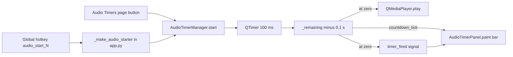
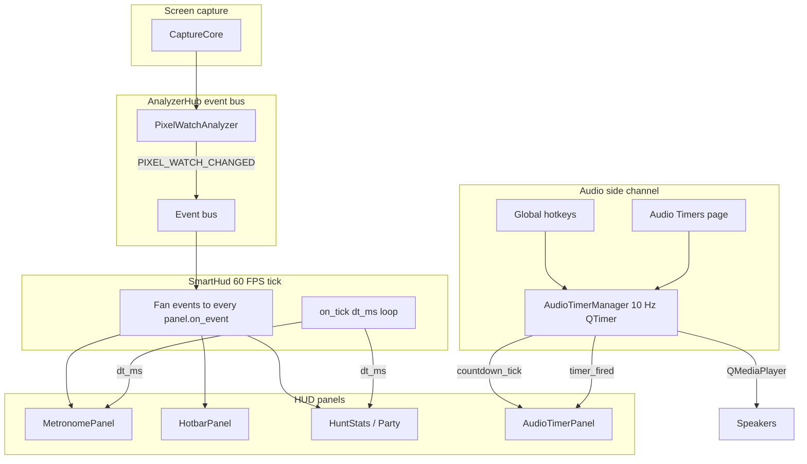

# How the countdown / cooldown system works

A practical, beginner-friendly tour of every "timer" inside tibiavision-linux,
what actually triggers each one, how it decrements, and what happens when it
hits zero. If you ever wondered "is this the spell cooldown, or a debounce,
or just UI cosmetics?", read this. It names names.

> **TL;DR**
> - **Only `AudioTimerManager` is a fully wired countdown end-to-end today.** It runs in software, ticks at 10 Hz, and plays a sound + flashes the HUD when it fires.
> - `MetronomePanel` *can* count, but the analyzer that would feed it (`SwingTimerAnalyzer`) is a stub, so in the current app it sits in "waiting..." forever.
> - `HotbarPanel` never counts anything. It's a read-only cheat-sheet of Tibia's own hotkey bindings.
> - The other things with "cooldown" in their names (`pixel_watch._COOLDOWN_MS`, `TriggerEngine.cooldown_ms`, `Region.track_cooldown`) are **not** gameplay timers.

---

## 1. Inventory

| Surface | File | What triggers it | Tick source | What fires at zero |
|---|---|---|---|---|
| Audio Timers | [`src/tvlinux/audio_timers.py`](../src/tvlinux/audio_timers.py) | User action (button or global hotkey) | One `QTimer` per timer, 100 ms interval | `QMediaPlayer` plays sound, HUD row flashes red, `timer_fired` Qt signal |
| Metronome | [`src/tvlinux/hud_panels/metronome_panel.py`](../src/tvlinux/hud_panels/metronome_panel.py) | Bus event `SWING_TIMER_RESET` | `SmartHud`'s 60 FPS `on_tick(dt_ms)` loop | HUD arc turns green, label "ready". No sound, no bus emit |
| Hotbar | [`src/tvlinux/hud_panels/hotbar_panel.py`](../src/tvlinux/hud_panels/hotbar_panel.py) | (never counts) | - | - |
| Cooldown CV | [`src/tvlinux/analyzers/cooldown_cv.py`](../src/tvlinux/analyzers/cooldown_cv.py) | Stub -- returns `[]` | - | - |
| Swing timer analyzer | [`src/tvlinux/analyzers/swing_timer.py`](../src/tvlinux/analyzers/swing_timer.py) | Stub -- returns `[]` | - | - |

Only the first row fires in the current build. Everything below that is scaffolding with clear extension points.

---

## 2. Audio Timers, top to bottom (the only fully wired cooldown)

This is the system you actually use when you want a reminder that something is off cooldown. It counts down in pure software and has nothing to do with reading pixels from the game.

### 2a. What starts a timer

Two entry points, both defined in [`src/tvlinux/audio_timers.py`](../src/tvlinux/audio_timers.py):

1. **Manual start** from the Audio Timers page (a button on the UI). This ends up calling `AudioTimerManager.start(tid)`.
2. **Global hotkey** `audio_start_0` .. `audio_start_9`. Registered in [`src/tvlinux/app.py`](../src/tvlinux/app.py) by `_register_shortcuts` and `_make_audio_starter`. When the user presses the bound key anywhere on the desktop, a slot lookup happens and `start(tid)` fires.

No key-press detection from inside the game, no pixel sampling -- the app never observes your cast. You tell it "start the 30 second rune timer", and it starts a 30 second counter.

### 2b. The tick loop

```python
def start(self, tid: UUID) -> None:
    timer = self._timers.get(tid)
    if timer is None:
        return
    self.stop(tid)
    self._remaining[tid] = timer.duration_s
    qt = QTimer(self)
    qt.setInterval(100)  # 10 Hz

    def on_tick() -> None:
        self._remaining[tid] = max(0.0, self._remaining.get(tid, 0.0) - 0.1)
        self.countdown_tick.emit(tid, self._remaining[tid])
        if self._remaining[tid] <= 0:
            qt.stop()
            self._running.pop(tid, None)
            self._play_sound(timer.sound_path)
            self.timer_fired.emit(tid)
```

Worth noticing:

- **One `QTimer` per running timer.** They are cheap. Ten of them running at the same time is fine.
- **Tick interval is 100 ms.** That means the UI updates 10 times per second, which is plenty for "seconds left" displays. We don't tick at 1 Hz because the bar animation would look choppy.
- **The decrement is fixed 0.1 s**, not "time since last tick". That's intentional: it keeps the math simple and predictable at the cost of being slightly affected by scheduling jitter (a busy event loop can drift by a few hundred ms per minute). For user-facing spell reminders that's invisible.

### 2c. What fires at zero

When `_remaining[tid]` reaches zero:

1. `qt.stop()` -- the `QTimer` itself stops, so we don't keep polling a dead timer.
2. `self._play_sound(timer.sound_path)` -- creates a `QMediaPlayer`, loads the user's configured sound file (or a silent no-op if no file is set), and plays it once.
3. `self.timer_fired.emit(tid)` -- a Qt signal broadcast to anyone listening. The HUD panel listens.

### 2d. How the HUD reacts

[`src/tvlinux/hud_panels/audio_timer_panel.py`](../src/tvlinux/hud_panels/audio_timer_panel.py) connects to the manager's Qt signals **directly**, not through the `AnalyzerHub` event bus:

```python
manager.countdown_tick.connect(self._on_tick)
manager.timer_fired.connect(self._on_fired)
manager.timer_started.connect(self._on_started)
manager.timer_stopped.connect(self._on_stopped)
```

This is a deliberate shortcut. The bus is designed for "something changed on screen" events shared across panels. A countdown is purely per-panel UI state, so going bus-less keeps latency minimal and panels decoupled from each other. If in the future we ever want other panels to react to "timer fired", we'd add a `TIMER_FIRED` bus event here.

On `timer_fired` the panel sets a `fire_flash_ms` counter that its `paint()` reads to draw a red overlay on the row for a short while (default `_FIRE_FLASH_MS`). Meanwhile the bar height is redrawn each tick from `_remaining / duration_s`.

### 2e. Data flow, Audio Timers



---

## 3. Metronome Panel (a countdown UI without a detector)

[`src/tvlinux/hud_panels/metronome_panel.py`](../src/tvlinux/hud_panels/metronome_panel.py) is the *other* countdown shape in the HUD: an arc that fills up between "hits" to show whether you're still inside a swing interval. The panel itself is complete. The detector behind it isn't.

### 3a. Trigger

The metronome listens to one bus event kind:

```python
def on_event(self, event: Event) -> None:
    if event.kind != EventKind.SWING_TIMER_RESET:
        return
    self._since_reset_ms = 0.0
    self._flash_ms = _FLASH_MS
    self._reset_count += 1
```

So the moment anything on the `AnalyzerHub` publishes an event with `kind=SWING_TIMER_RESET`, the panel zeroes its elapsed counter and flashes briefly.

**In the current app nothing ever publishes that event kind.** The only producer would be [`src/tvlinux/analyzers/swing_timer.py`](../src/tvlinux/analyzers/swing_timer.py), whose `analyze()` currently returns an empty list and which is not even registered in `app.py`. So the panel sits in "waiting..." until a test or future analyzer feeds it.

### 3b. Tick source

Unlike Audio Timers, the metronome does **not** own a `QTimer`. `SmartHud` (the parent HUD container) runs a 60 FPS paint loop in [`src/tvlinux/smart_hud.py`](../src/tvlinux/smart_hud.py):

```python
def _on_frame(self) -> None:
    now = time.monotonic()
    dt_ms = (now - self._last_tick_ts) * 1000.0
    self._last_tick_ts = now
    for slot in self._slots.values():
        slot.panel.on_tick(dt_ms)
    self.update()
```

On every frame, `SmartHud` calls every panel's `on_tick(dt_ms)` with the monotonic time since the last frame. The metronome's `on_tick` advances its `_since_reset_ms` and decays the flash alpha. This is **delta-time accumulation**, not a fixed decrement like Audio Timers.

### 3c. What fires at zero... well, at the target interval

The metronome has a target interval (default 2000 ms) and renders three states in `paint`:

- Less than one tick: "waiting..."
- Between 0 and the target interval: the arc fills from 0 to 1 and the label shows `elapsed ms / target ms`
- Past the target: the arc stays full and the label turns green: "ready"

No sound. No HUD-wide signal. No bus emit. It is a purely visual rhythm meter.

### 3d. What would need to change to light it up

1. Implement `SwingTimerAnalyzer.analyze(frame)` in [`src/tvlinux/analyzers/swing_timer.py`](../src/tvlinux/analyzers/swing_timer.py) to return `Event(kind=SWING_TIMER_RESET, ...)` when it detects a hit.
2. Register the analyzer in `Application._register_analyzers` in [`src/tvlinux/app.py`](../src/tvlinux/app.py) alongside `PixelWatchAnalyzer`.
3. That's it. The panel plugs straight in via the existing bus.

---

## 4. Hotbar Panel (no countdown at all)

[`src/tvlinux/hud_panels/hotbar_panel.py`](../src/tvlinux/hud_panels/hotbar_panel.py) draws a key -> spell/item table pulled straight from Tibia's own `clientoptions.json`. It refreshes when the preset file changes (the app sees that via `LOGIN_DETECTED` from `PresetWatcher`).

It does not detect casts, it does not count cooldowns, it does not watch pixels. If you press your rune key in Tibia, the hotbar panel does not know. It is a permanent read-only label of your bindings. This gets confused with cooldown UI a lot, so: **the hotbar panel is a reference sheet, not a timer**.

---

## 5. Things that look like cooldowns but are not

The codebase has four places with "cooldown" or "timer" in the name that are **not** gameplay timers. Ignoring this distinction is how beginners waste a weekend wiring the wrong thing.

### 5a. `pixel_watch._COOLDOWN_MS`

In [`src/tvlinux/analyzers/pixel_watch.py`](../src/tvlinux/analyzers/pixel_watch.py) the constant `_COOLDOWN_MS = 500` is a **debounce**: after a pixel region changes and the analyzer emits `PIXEL_WATCH_CHANGED`, the same region cannot re-emit for 500 ms. This stops a flickering spell icon from spamming the bus. Not a game cooldown.

### 5b. `TriggerEngine.cooldown_ms`

In [`src/tvlinux/trigger_engine.py`](../src/tvlinux/trigger_engine.py) each rule has its own `cooldown_ms` field. After a rule's action runs in response to a bus event, the rule can't run again for that many ms. This is **per-rule action throttling**, so a trigger like "on enemy spotted, log it" doesn't log a hundred times per second.

### 5c. `Region.track_cooldown`

In [`src/tvlinux/regions.py`](../src/tvlinux/regions.py) the `Region` dataclass has a `track_cooldown: bool` field, and the UI exposes a "Track cooldown proc (OCR)" checkbox. There is **no consumer** in the code today. It is a feature hook for a future OCR analyzer. Setting the checkbox saves the flag and does nothing else.

### 5d. `stats_math.py`

[`src/tvlinux/stats_math.py`](../src/tvlinux/stats_math.py) is hunt-session math: XP/h, profit/h, loot splits, extrapolations. No cooldown anywhere in there.

---

## 6. End-to-end picture



Two paths, two philosophies:

- **Left path** (capture -> analyzers -> bus -> panels) is the future home of CV-based cooldowns. Today only `PixelWatchAnalyzer` is registered, and only the pixel-watch event kind is produced.
- **Right path** (hotkey or UI -> `AudioTimerManager` -> `AudioTimerPanel` + speakers) is the working cooldown/reminder system, entirely software-driven, entirely user-controlled.

---

## 7. What happens when a timer fires -- the "executions" summary

| Timer | Sound | HUD | Bus event | Other side effects |
|---|---|---|---|---|
| Audio Timer | `QMediaPlayer` plays user sound once | Row flashes red for `_FIRE_FLASH_MS`, bar resets | None | `timer_fired(tid)` Qt signal to listeners |
| Metronome | None | Arc stays at target, label turns green | None | None |
| Pixel-watch debounce (500 ms) | - | - | Suppresses further `PIXEL_WATCH_CHANGED` for that region | - |
| Trigger rule cooldown | - | - | Suppresses further rule action runs | - |

---

## 8. How to add a new real cooldown (example)

Say you want a "red health potion cooldown" reminder that plays a sound when ready.

Simplest working version, today, no code changes required:

1. Open the Audio Timers page.
2. Add a new timer: name "Red pot", duration 1.0 s, choose a sound, optionally bind it to hotkey slot 0.
3. Bind `audio_start_0` to the same key you press in Tibia to drink a red pot.
4. Now every time you press that key, the app starts its own 1 second counter and beeps when it's over. The app never touched Tibia -- it watched the same key you pressed globally.

Full CV version, future work:

1. Implement `CooldownAnalyzer` in [`src/tvlinux/analyzers/cooldown_cv.py`](../src/tvlinux/analyzers/cooldown_cv.py) to sample the hotbar ROI and detect saturation changes. Return `Event(kind=COOLDOWN_STARTED, ...)` and `Event(kind=COOLDOWN_READY, ...)`.
2. Register the analyzer in `Application._register_analyzers`.
3. Add a new HUD panel that subscribes to those two event kinds and paints a circular cooldown overlay per slot.

The important property of the architecture: **nothing in these paths ever sends input back to Tibia**. All the countdowns are observational or software-only. See [`docs/safety.md`](safety.md) for the BattlEye review of these decisions.
